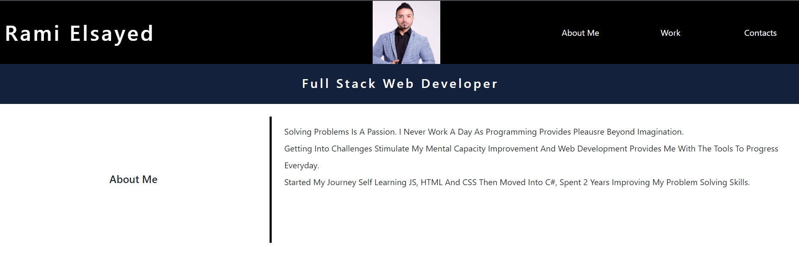
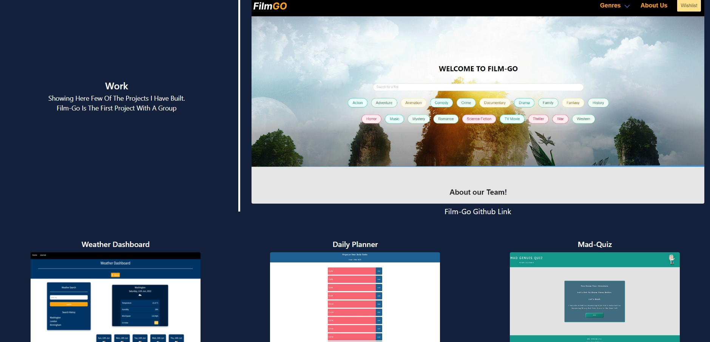

# My Portfolio

## Description

- You can find my initial projects I worked on this page using JavaScript, HTML and CSS.
- You can find my contact links on the bottom of the page including my GitHub.
- I am illustrating through my work the ability of solving problems and using good coding practices keeping my code clean following the OOP concepts.
- Understanding the issues and finding the best tools

[my portfolio](https://ramielsayed.github.io/my-portfolio/)

